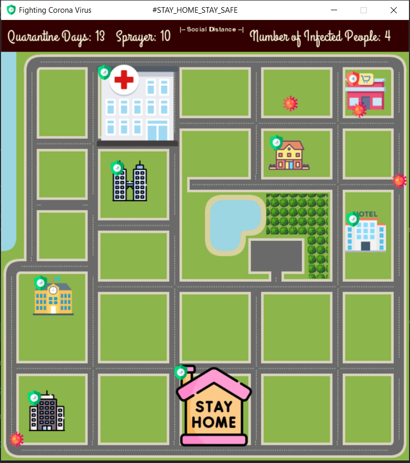

# COV-Fighter

- Cov-Fighter is a python game build with pygame library.
- This game is built within COVID-19 quarantine.
- This game is just for fun nothing else. You can make your children play it to increase their awareness.

## Installation

If you have python installed in your machine. just install *pygame* with the following command

```bash
pip install pygame
```

If you don't have python installed you can simply download the .exe file from [here]()

## Rules

The rules are simple. The player only have one mission to do three times during quarantine period.

Here is the story:
- You must stay home while the 14 days of the quarantine.
- You only have to go out to get your needs from the market at these days (10, 5, 1)
- But watch out!. Th virus is spreading in your city and you must stay away from the infected areas.
- If you are infected you must go to the hospital to be quarantined and you will reset the quarantine period.
- If you finish this mission three times at the specified days, you will overcome the virus.
- If you go back to your home while you are infected, you will infect your family and lose the game.
- You have 10 sprayer to kill the surrounding viruses.



You will be allowed to move in these days (10, 5, 1). you can move using **ARROWS** keys.
You can use the sprayer with **SPACE** key


## Contributing
Pull requests are welcome. For major changes, please open an issue first to discuss what you would like to change.

